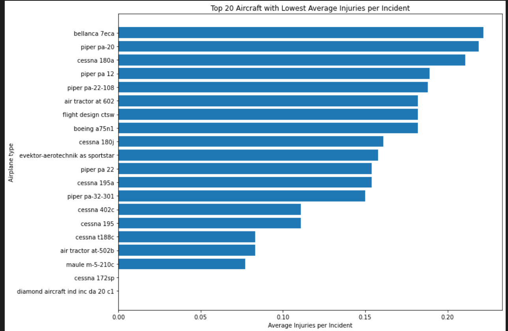
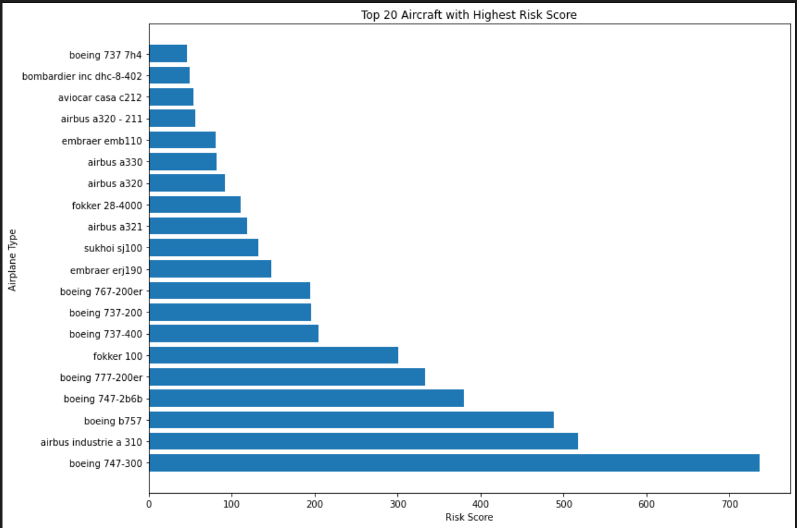

# Aviation Risk Analysis Project

## Business Problem
The company seeks to expand into aviation by purchasing and operating aircraft for commercial and private use.
Given no prior aviation experience, the goal is to identify **lowest-risk aircraft** using historical accident and injury data.

## Dataset
- Source: Aviation_Data.csv
- Scope: Aircraft accident and incident records
- Focus: Airplanes only

A comprehensive dataset containing aircraft accident and incident records. Rather than attempting to predict future accidents, the project focuses on identifying patterns of risk and severity when incidents occur.

## Methodology
The project followed a structured, step-by-step approach to transform raw accident data into actionable business insight:

1. Data cleaning and preprocessing
2. Filtering to airplane category
3. Injury aggregation and severity weighting
4. Damage severity analysis
5. Engine and amateur-built risk assessment
6. Composite weighted risk scoring

This methodology allowed different aircraft types to be compared objectively using consistent criteria.

## Key Metrics
To capture both frequency and severity, several key metrics were used:

- Total Injuries
- Average Injuries per Incident
- Risk Score (weighted by injury severity)
- Damage Risk
- Injury Severity Risk
- Composite Weighted Risk

Together, these metrics provide a multi-dimensional view of aircraft risk rather than relying on a single indicator.

## Key Findings
- Small general aviation airplanes, such as Cessna 152 and Cessna 172 variants, consistently demonstrated lower risk profiles. Incidents involving these aircraft typically resulted in fewer injuries and less severe outcomes.

- In contrast, large commercial jets exhibited significantly higher weighted risk scores. While accidents involving these aircraft are less frequent, their outcomes are often severe due to higher passenger capacity and operational complexity.

-Across all aircraft types, substantial and destroyed damage accounted for the majority of incidents, highlighting the importance of damage severity in risk evaluation.

- When injuries did occur, fatal and non-fatal injuries made up most outcomes, reinforcing the need for severity-based weighting rather than simple incident counts.

-Additional analysis showed that amateur-built airplanes experienced fewer severe damage outcomes, though this may reflect differences in usage and reporting rather than inherent safety advantages.

- no of damage vs damage type

- injury severity vs no of engine

## Recommendations
Based on the analysis, the following actions are recommended:
- Prioritize small general aviation airplanes for initial market entry
- Avoid high-capacity commercial jets in early expansion
- Focus on aircraft with low average injuries per incident
- Incorporate weighted risk score into procurement decisions
These steps allow the company to build aviation capability while managing downside risk.

## Limitations
This analysis assumes missing injury values indicate zero reported injuries, which may understate minor incidents. Additionally, historical accident data may not fully reflect modern safety improvements or future operational changes.
## Future Work
Future iterations of this project could expand the analysis by:
- Incorporating maintenance and operating cost data
- Adding probabilistic and exposure-based risk modeling
These enhancements would support more advanced aviation risk management strategies.

## Tableau Visualization link
An interactive version of the analysis is available on Tableau:

[Tableau link](https://public.tableau.com/authoring/AirplaneRiskAnalysis/Dashboard1) 