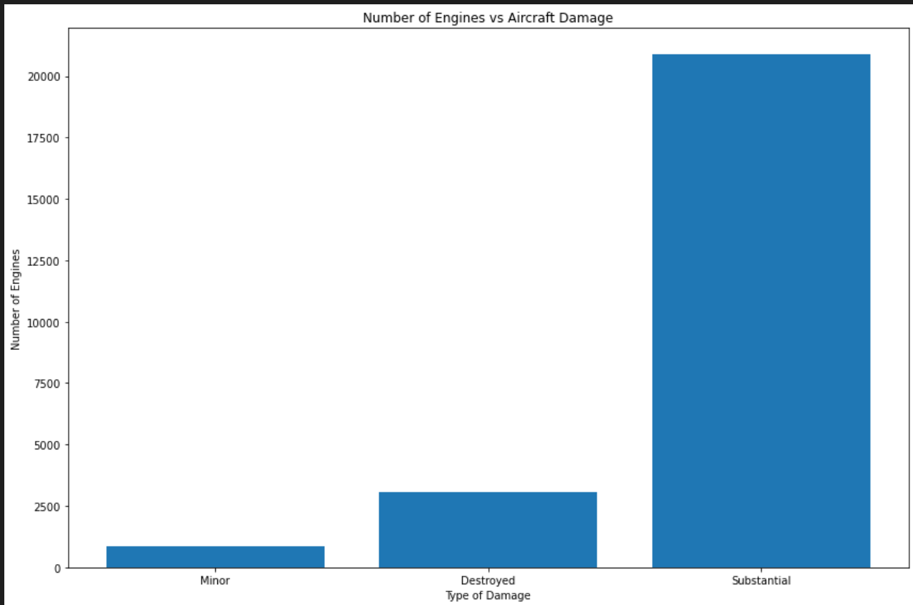
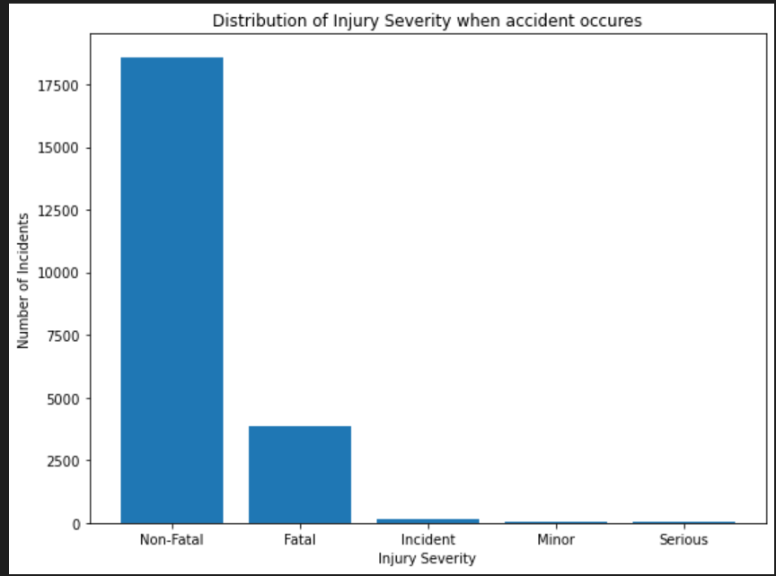
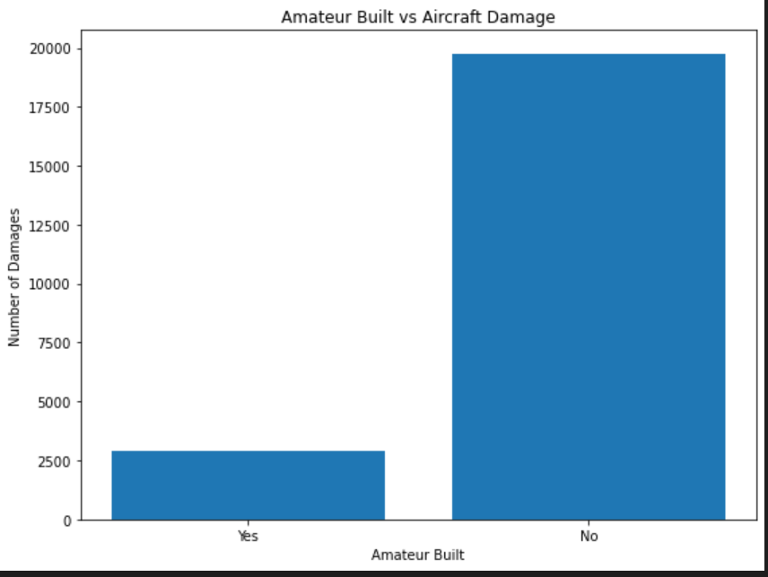
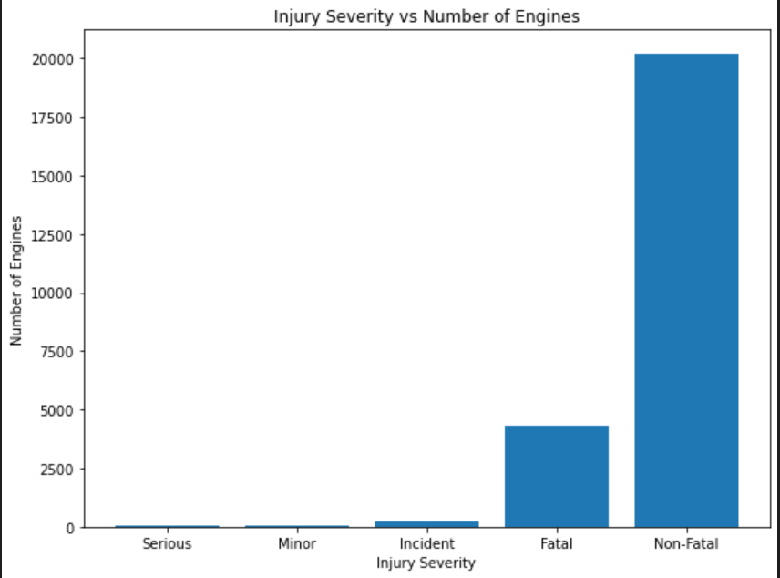

# Aviation Risk Analysis Project

## Business Problem
The company seeks to expand into aviation by purchasing and operating aircraft for commercial and private use.
Given no prior aviation experience, the goal is to identify **lowest-risk aircraft** using historical accident and injury data.

## Dataset
- Source: Aviation_Data.csv
- Scope: Aircraft accident and incident records
- Focus: Airplanes only

## Methodology
1. Data cleaning and preprocessing
2. Filtering to airplane category
3. Injury aggregation and severity weighting
4. Damage severity analysis
5. Engine and amateur-built risk assessment
6. Composite weighted risk scoring

## Key Metrics
- Total Injuries
- Average Injuries per Incident
- Risk Score (weighted by injury severity)
- Damage Risk
- Injury Severity Risk
- Composite Weighted Risk

## Key Findings
- General aviation airplanes (e.g. Cessna 152, Cessna 172 variants) show consistently low risk

- Large commercial jets show high weighted risk due to severe outcomes when accidents occur

- Substantial and destroyed damage dominate incidents

- Fatal and non-fatal injuries account for most outcomes

- Amateur-built airplanes show lower damage frequency

- no of damage vs damage type

- injury severity vs no of engine

## Recommendations
- Prioritize small general aviation airplanes for initial market entry
- Avoid high-capacity commercial jets in early expansion
- Focus on aircraft with low average injuries per incident
- Incorporate weighted risk score into procurement decisions

## Limitations
- Assumes missing injury values imply zero injuries
- Historical data may not reflect future safety improvements

## Future Work
- Include maintenance and cost data
- Model probabilistic risk

## Tableau Visualization link
[Tableau link](https://public.tableau.com/authoring/AirplaneRiskAnalysis/Dashboard1) 